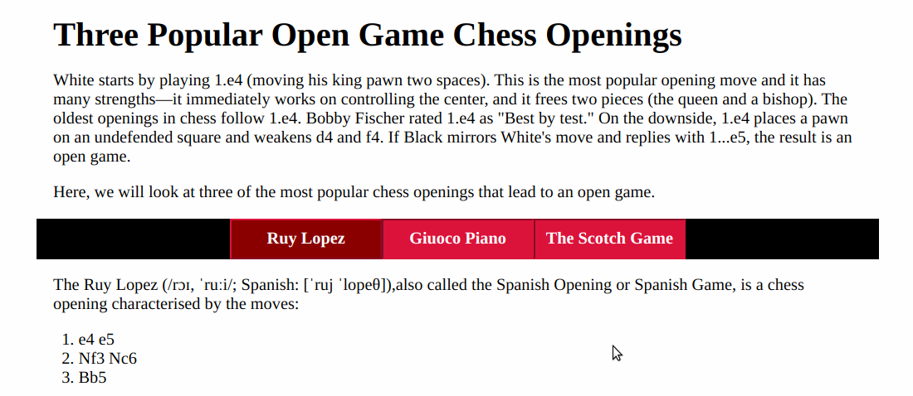
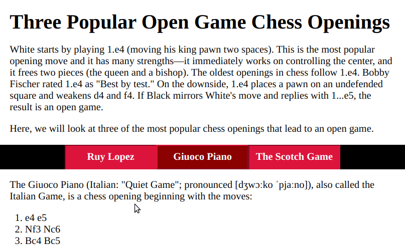
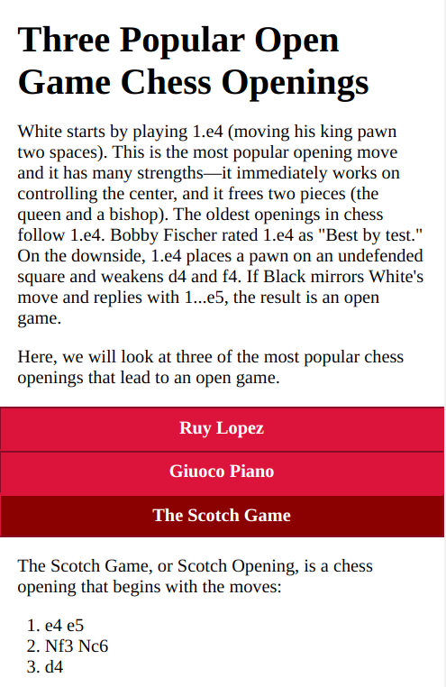

# Creating Tabs from Radio Buttons

You'll find an article with an introduction and three sections in [article.md](article.md).

Use this to create a web page with 3 tabs, one for each section.

## Instructions
 1. Create a `main` element with a header and the introductory paragraphs.
 2. Create a `div` which contains three `label` elements, one for each of the sections
 3. Inside each `label`, include:
    * A radio button `input` element
    * A `span` for the section title
    * A `div` to contain the text of each section
4. Remember that all radio button inputs with the same `name` attribute belong to the same radio button group, and that only one can be checked at any one time.
5. Remember that you can use the `:checked` pseudo class to create different rules for the checked and unchecked state of each radio button input.
6. Remember that you can use the `+` next sibling combinator and the  `~` younger sibling combinator to select the siblings of the `input` element.
7. Make sure that your solution is responsive. When the viewport is narrow, the `label`s can be stacked vertically. When it is wide enough, they can be arranged in a row.
8. Remember to cite the source of each section

## Demo
You can find a working demo [here](https://dciforks.github.io/UIB-data-checkbox-menu/)

## Screenshots
* Desktop layout

* Tablet layout

* Smartphone layout

