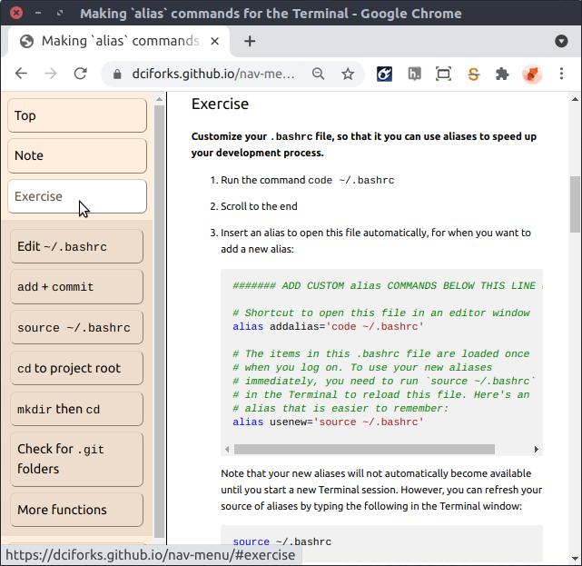

# Assignment: Create a Navigation Menu

This repository contains a tutorial on how to create `alias` commands to speed up your use of the Terminal.

The index.html file contains a \<nav> tag containing internal links to all the elements inside the \<main> tag that have an `id` attribute. Some of these links refer to specific `alias` commands, while others refer to more general explanations.

    <nav>
      <a href="#making-alias-commands-for-the-terminal">Top</a>
      <a href="#note">Note</a>
      <a href="#exercise">Exercise</a>
      

        <a href="#edit-bashrc">Edit <code>~/.bashrc</code></a>
        <a href="#gmit"><code>add</code> + <code>commit</code></a>
        <a href="#usenew"><code>source ~/.bashrc</code></a>
        <a href="#gd"><code>cd</code> to project root</a>
        <a href="#mkcd"><code>mkdir</code> then <code>cd</code></a>
        <a href="#gits">Check for <code>.git</code> folders</a>
        <a href="#more-functions">More functions</a>
      

      <a href="#share-your-aliases">Share your <code>alias</code>es</a>
    </nav>

    <main>
      <h1 id="making-alias-commands-for-the-terminal">
      ...
    </main>

Please edit the `css/styles.css` file to layout a menu bar down the left side of the page, with rules that provide visual feedback for:

* Which links refer to `alias` commands
* The mouse moving over a link
* A press on a link
* A link that has been visited

Use `padding` to make sure that the main text is not hidden behind the menu bar.

**Your final result might look something like this...**

... but of course, yours will be more beautiful. (You can click on the image above to visit an interactive page.)
